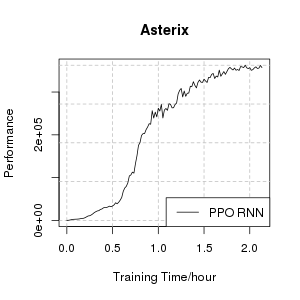
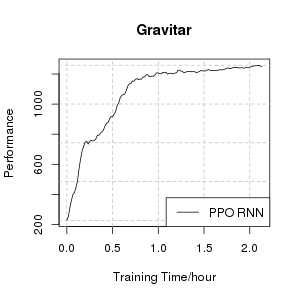
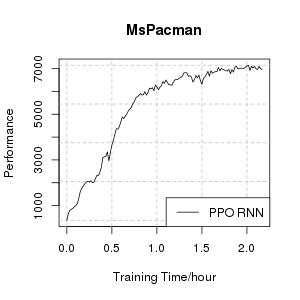

Benchmark
=========

Environment Setting
-------------------

We evaluate the framework on the Atari 2600 video games from Arcade Learning Environment (ALE), which is widely used as a standard benchmark for deep reinforcement learning, especially for distributed training. There are at least two evaluation protocols, One is the *human starts* protocol, in which each episode for evaluation is started at a state sampled from human play. The other is the *no-ops starts* protocol, in which the starting state of an episode for evaluation is generated by playing a random length of no-op actions in the environment. We adopt the later evaluation protocol both for training and testing in this work. The environment is based on the implementation in OpenAI Gym. We mostly follow the environment settings as in the original Nature paper. The environment is randomly initialized by playing a random number (no more than 30) of no-op actions. During playing, each action is repeated for 4 contiguous frames, and every 4th frame is taken a pixel-wise max over previous frame, and then returned as the screen observation. The size of raw screen is 210x160 pixels with 128 colors. The colored image is firstly converted to gray-scale and then resized to 84x84 pixels represented by integers from 0 to 255, followed by a scale to floats between 0 to 1. We also use the *episodic life* trick in the training phase: For games with a life counter, the loss of life is marked as an end for the current episode. The rewards are clipped with a sgn() function, such that positive rewards are represented by 1, negative rewards as -1, and 0 otherwise. In addition to the settings above, we also reset the environment if no reward is received in 1000 steps, to prevent the environment from accidental stuck.

Network Structure
-----------------

For comparable results, we use the same network structure as in the original Nature paper. The first layer consists of 32 convolution filters of 8x8 with stride 4 and applies a ReLU non-linearity. And the second layer convolves the image with 64 filters of 4x4 with stride 2 followed by a ReLU rectifier. The third layer has 64 filters of 3x3 with stride 1 followed by a rectifier. The output layer is fully-connected and consists of 512 ReLU units. For vanilla model, the input is stacked with 4 frames; while for RNN model, we put an additional LSTM layer with 256 cells after the fully-connected layer.

Training Framework
------------------

For large-scale training with the interested algorithms, we adopt an *Actor-Learner* style distributed framework. In our distributed framework, actors are responsible for generating massive trajectories with current policy; while learners are responsible for updating policy with the data generated by the actors. To be specific, in its main loop, an actor runs a local environment with actions from current local policy, and caches the generated data at local memory. The running policy is updated periodically to the latest policy at the learner; while the generated data is sent to the learner asynchronously. At the learner side, the learner keeps at most 4 latest episodes generated by each actor, in a FIFO manner. Each batch of samples for training are randomly sampled from these trajectories with replacement. We deploy the distributed training framework on a small cluster. The learner runs on a GPU machine and occupies an M40 card. And a total of 128 actors are equally distributed on 8 machines equipped with 2.5GHz Xeon Gold 6133 CPUs.

Algorithm Settings
------------------

The algorithm is implemented with TensorFlow. For experiments on Atari, we train the model for a total of 200 million frames (that is batch_size x n_batch). For efficient training with deep neural network, we use the Adam method for optimization. The learning rate is linearly scaled from 1e-3 to 0. The parameters are updated according to a mixture of policy loss and value loss, with the baseline loss scaling coefficient c = 0.5. In calculating multi-step lambda-returns R_{s,a} we use fixed lambda = 0.9 and gamma = 0.99. The batch size is set to 1024, with roll-out length set to 32, resulting in 1024/32=32 roll-outs in a batch. The policy pi_t and value V_t is updated every 100 iterations. With our implementation, the training speed is about 27k samples per second, and the data generating speed is about 28.5k samples per second, corresponding to about 220 samples per second for each actor. We set the number of actors intentionally so that the data generating speed roughly matches the training speed. As each sample is used only once (on average) in training, we can assume the training samples are i.i.d. from pi_t d_t, without correlation. 

Performance
-----------
The empirical performance of PPO on Atari games are shown in the following plots:

